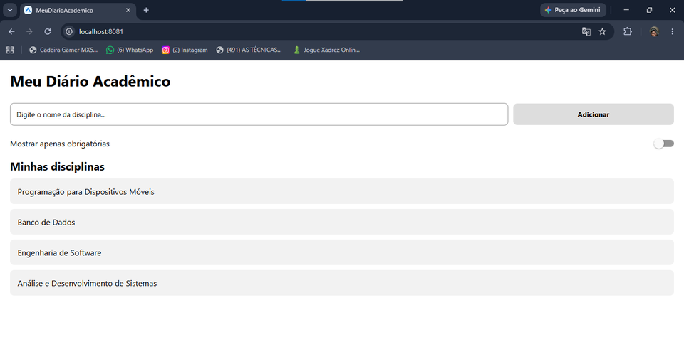

# 📱 MeuDiarioAcademico

Aplicativo desenvolvido para a disciplina de **Programação para Dispositivos Móveis** do IESB, utilizando **React Native** e **Expo**.

## 🎯 Objetivo

A atividade tem como objetivo praticar os fundamentos de criação de interfaces em React Native, utilizando **Core Components**, **import/export**, **StyleSheet** e **Flexbox**.

---

## 🚀 Criação do Projeto

O projeto foi criado utilizando o comando `npx create-expo-app@latest MeuDiarioAcademico --template blank`.

## 📦 Instalação

As dependências do projeto foram instaladas utilizando `npm install`.

A biblioteca utilizada para o `SafeAreaView` foi instalada utilizando `npx expo install react-native-safe-area-context`.

## ▶️ Como Executar

Para iniciar o projeto, utilize o comando `npx expo start`.

Após iniciar o servidor, o aplicativo pode ser aberto pelo **Expo Go** ou por um emulador Android.

---

## 🧩 Componentes Utilizados

- `SafeAreaView`
- `SafeAreaProvider`
- `View`
- `Text`
- `TextInput`
- `Pressable`
- `Switch`

---

## 📂 Organização do Código

Os principais rótulos da aplicação foram separados no arquivo `labels.js`, utilizando `export` e `import` para melhorar a organização do código.

A interface principal foi desenvolvida no `App.js`, utilizando componentes nativos do React Native.

O layout utiliza **Flexbox** para organizar os elementos da tela, principalmente o campo de entrada e o botão de adicionar.

Também foram utilizados valores em **porcentagem (%)** e **flex** para tornar o layout mais adaptável a diferentes tamanhos de tela.

---

## 📋 Funcionalidades

- Exibição do título do aplicativo;
- Campo para inserir o nome de uma disciplina;
- Botão **Adicionar**;
- Lista estática de disciplinas;
- Opção visual **Mostrar apenas obrigatórias**;
- Efeito visual ao pressionar o botão;
- Layout organizado utilizando Flexbox;
- Estilização utilizando `StyleSheet.create`.

> **Observação:** nesta atividade a lista de disciplinas é estática. O botão "Adicionar" e o filtro de disciplinas obrigatórias possuem apenas finalidade visual, conforme solicitado na atividade.

---

## 📐 Layout

A tela foi estruturada utilizando:

- `flexDirection: 'row'` para manter o campo de entrada e o botão na mesma linha;
- `width: '75%'` no campo de entrada;
- `flex: 1` no botão para ocupar o espaço restante;
- `justifyContent` e `alignItems` para alinhamento dos elementos;
- `flex: 1` no container principal para ocupar o espaço disponível da tela.

---

## 📸 Evidências

### Tela Principal

---

## 🛠️ Tecnologias Utilizadas

- React Native
- Expo
- JavaScript
- Flexbox
- StyleSheet
- Expo Go

---

## 👨‍💻 Disciplina

**Programação para Dispositivos Móveis**  
**IESB**