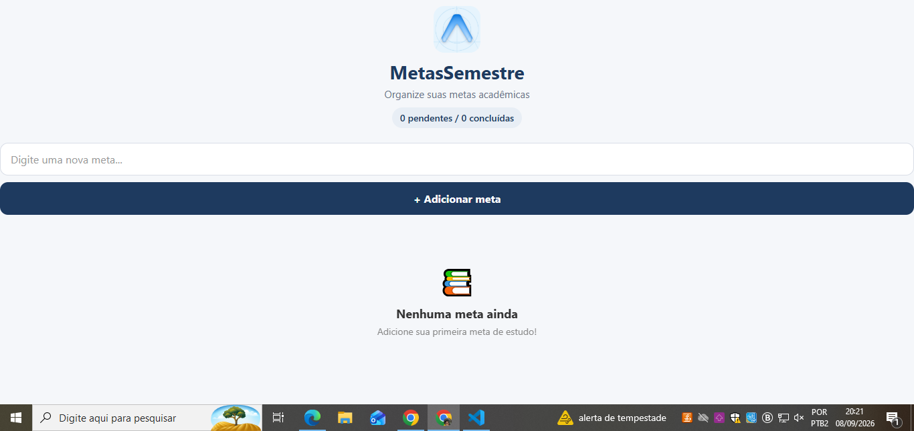
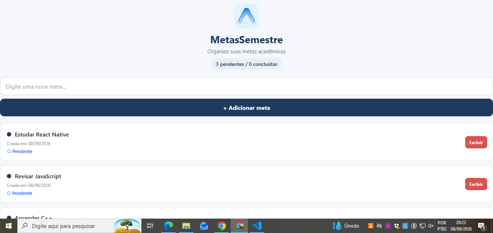
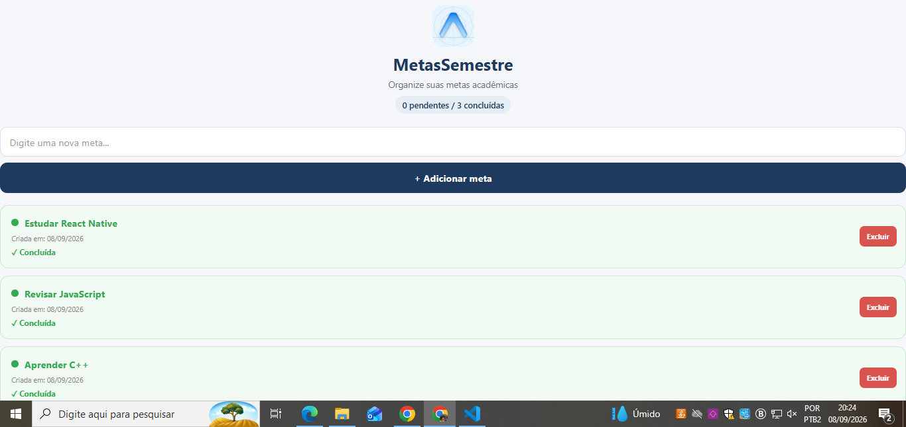

# 📚 MetasSemestre

Aplicativo desenvolvido em **React Native com Expo** para gerenciamento de metas acadêmicas do semestre.

O projeto foi desenvolvido como parte da **Atividade 02 — Estado, Eventos e Persistência**, da disciplina de **Programação para Dispositivos Móveis** do IESB.

---

## 🎯 Objetivo

O objetivo do aplicativo é permitir que o usuário cadastre, visualize, conclua e exclua suas metas acadêmicas.

As metas cadastradas são armazenadas localmente no dispositivo, permitindo que continuem disponíveis mesmo após fechar e abrir o aplicativo novamente.

---

## 🛠️ Tecnologias utilizadas

* React Native
* Expo
* JavaScript
* AsyncStorage
* React Native Safe Area Context
* VS Code

---

## 📱 Funcionalidades

O aplicativo possui as seguintes funcionalidades:

* ➕ Adicionar novas metas;
* ❌ Excluir metas;
* ✅ Marcar metas como concluídas;
* 🔄 Alternar entre meta pendente e concluída;
* 💾 Salvar as metas no armazenamento local;
* 📂 Carregar as metas salvas ao abrir o aplicativo;
* 📊 Exibir a quantidade de metas pendentes e concluídas;
* ⚠️ Validar o cadastro de metas vazias;
* 📅 Registrar a data de criação de cada meta.

---

## 🧩 Estrutura do projeto

```text
MetasSemestre/
│
├── assets/
│   └── icon.png
│
├── components/
│   ├── MetaInput.js
│   └── MetaList.js
│
├── screenshots/
│   ├── lista-vazia.png
│   ├── metas-cadastradas.png
│   └── metas-persistidas.png
│
├── App.js
├── index.js
├── app.json
├── package.json
└── README.md
```

### Componentes

#### `App.js`

É o componente principal da aplicação.

Nele são controlados:

* Estado das metas;
* Estado do campo de texto;
* Adição de novas metas;
* Exclusão de metas;
* Conclusão das metas;
* Carregamento das informações;
* Salvamento das informações;
* Contador de metas pendentes e concluídas.

#### `MetaInput.js`

Componente responsável pelo campo de entrada e pelo botão de adicionar uma nova meta.

Recebe as seguintes propriedades:

* `value`
* `onChangeText`
* `onAdd`

#### `MetaList.js`

Componente responsável pela exibição das metas utilizando `FlatList`.

Cada meta apresenta:

* Texto da meta;
* Data de criação;
* Status da meta;
* Indicador visual de conclusão;
* Botão para exclusão.

---

## 💾 Persistência com AsyncStorage

O aplicativo utiliza o **AsyncStorage** para armazenar as metas localmente.

A chave utilizada para armazenamento é:

```javascript
@metas_semestre
```

### Carregamento das metas

O primeiro `useEffect` é executado quando o aplicativo é iniciado.

Ele utiliza:

```javascript
AsyncStorage.getItem()
```

para verificar se existem metas salvas.

Os dados são convertidos novamente para objetos JavaScript utilizando:

```javascript
JSON.parse()
```

Também existe tratamento de erro utilizando `try/catch`.

### Salvamento das metas

O segundo `useEffect` acompanha as alterações realizadas no estado `metas`.

Sempre que uma meta é adicionada, excluída ou marcada como concluída, a lista atualizada é convertida para JSON utilizando:

```javascript
JSON.stringify()
```

e salva no AsyncStorage através de:

```javascript
AsyncStorage.setItem()
```

Dessa forma, o aplicativo mantém os dados mesmo depois de ser fechado.

---

## ✅ Estado de conclusão

Cada meta possui uma propriedade:

```javascript
concluida: false
```

Quando o usuário toca em uma meta, seu estado é alterado.

Uma meta pendente é apresentada com o indicador azul, enquanto uma meta concluída recebe uma identificação visual verde.

As metas concluídas **não são riscadas**, sendo diferenciadas através das cores e do status exibido.

---

## ⚠️ Validação

O aplicativo não permite adicionar uma meta vazia.

Caso o usuário tente adicionar uma meta sem informar um texto, o aplicativo utiliza `Alert.alert()` para apresentar uma mensagem de validação:

```text
Meta inválida

Digite uma meta antes de adicionar.
```

> **Observação:** o comportamento visual do `Alert` pode variar de acordo com o ambiente utilizado para executar o aplicativo. Durante os testes, a validação do campo é executada corretamente, porém a janela de alerta pode não ser exibida em alguns ambientes, como a versão Web. Em dispositivos Android/iOS ou emuladores, o comportamento pode ser diferente.


## 📸 Capturas de tela

### 1. Lista vazia

Tela inicial do aplicativo sem nenhuma meta cadastrada.



---

### 2. Metas cadastradas

Exemplo do aplicativo com metas adicionadas, demonstrando a listagem e os diferentes estados das metas.



---

### 3. Persistência dos dados

Após fechar e abrir novamente o aplicativo, as metas continuam disponíveis graças ao armazenamento realizado com AsyncStorage.



---

## 🚀 Como executar o projeto

Primeiro, instale as dependências:

```bash
npm install
```

Caso as dependências específicas ainda não estejam instaladas:

```bash
npx expo install @react-native-async-storage/async-storage react-native-safe-area-context
```

Depois, execute o projeto:

```bash
npx expo start
```

O aplicativo poderá ser executado utilizando um dispositivo físico com **Expo Go** ou um emulador compatível.

---

## 🎓 Atividade acadêmica

**Disciplina:** Programação para Dispositivos Móveis
**Instituição:** IESB
**Professor:** Marcelo Alves Farias
**Atividade:** Atividade 02 — Estado, Eventos e Persistência
**Projeto:** MetasSemestre
