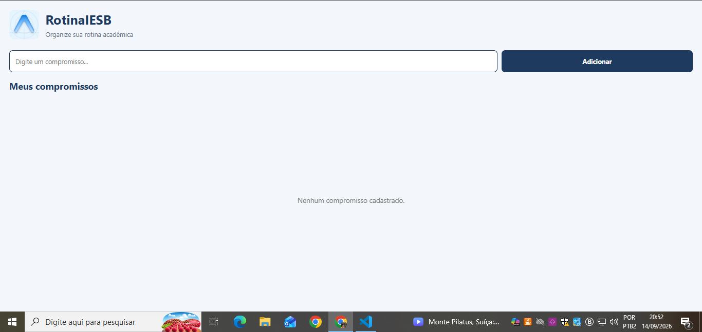
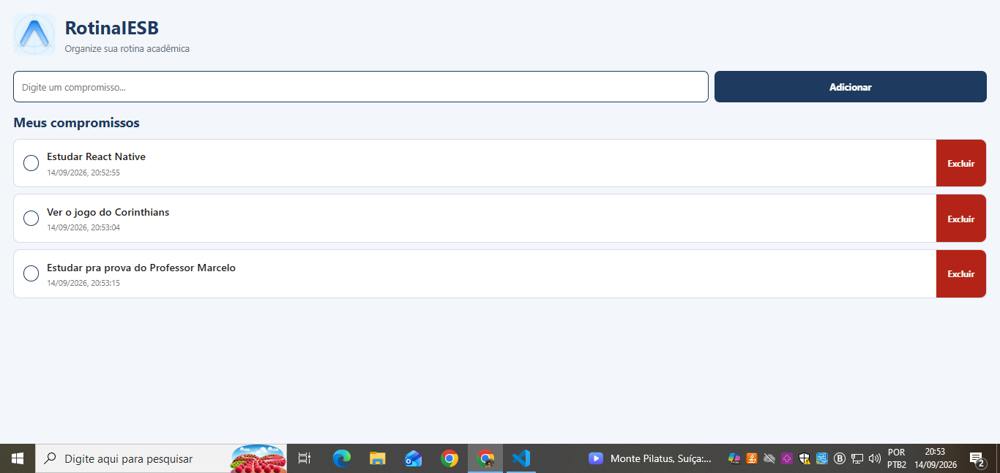

# RotinaIESB

Aplicativo desenvolvido para a disciplina de Programação para Dispositivos Móveis do IESB.

O **RotinaIESB** é um organizador simples da rotina acadêmica do aluno, permitindo cadastrar compromissos, marcar atividades como concluídas, excluir compromissos e manter os dados salvos mesmo após fechar e reabrir o aplicativo.

## Tecnologias utilizadas

* React Native
* Expo
* JavaScript
* AsyncStorage
* react-native-safe-area-context

## Criação do projeto

O projeto foi criado utilizando o comando:

```bash
npx create-expo-app@latest RotinaIESB --template blank
```

As dependências utilizadas para a atividade foram instaladas com:

```bash
npx expo install @react-native-async-storage/async-storage react-native-safe-area-context
```

Para executar o projeto:

```bash
npx expo start
```

## Funcionalidades

* Cadastro de compromissos.
* Validação para impedir compromissos vazios.
* Identificação única de cada compromisso.
* Marcação de compromisso como concluído.
* Alteração visual dos compromissos concluídos.
* Exclusão individual de compromissos.
* Persistência dos dados com AsyncStorage.
* Recuperação dos compromissos ao reabrir o aplicativo.
* Interface organizada utilizando Flexbox.
* Componentização utilizando props.

## Estrutura do projeto

```text
RotinaIESB/
├── App.js
├── app.json
├── package.json
├── labels.js
├── README.md
├── assets/
│   └── logo.png
└── components/
    ├── CompromissoInput.js
    └── CompromissoList.js
```

## Componentes

### CompromissoInput.js

Localizado em:

```text
components/CompromissoInput.js
```

Responsável pelo campo de texto e pelo botão de adicionar compromisso.

Recebe as seguintes props:

* `value`
* `onChangeText`
* `onAdd`
* `labels`

### CompromissoList.js

Localizado em:

```text
components/CompromissoList.js
```

Responsável pela exibição dos compromissos, marcação como concluído e exclusão dos itens.

Recebe as seguintes props:

* `itens`
* `onToggle`
* `onDelete`
* `tituloLista`
* `listaVazia`

## Rótulos

O arquivo:

```text
labels.js
```

utiliza exports nomeados para centralizar os textos da aplicação.

São utilizados:

* `tituloApp`
* `placeholderCompromisso`
* `botaoAdicionar`
* `tituloLista`
* `listaVazia`

## Estado e eventos

O `App.js` utiliza `useState` para controlar:

* texto digitado no campo de compromisso;
* lista de compromissos.

Cada compromisso possui a estrutura:

```javascript
{
  id,
  texto,
  criadoEm,
  concluido
}
```

A remoção é realizada utilizando `filter()` com base no `id` único do compromisso.

A conclusão é controlada pelo campo booleano `concluido`.

## Persistência

A chave utilizada no AsyncStorage é:

```text
@rotina_iesb_compromissos
```

### Carregamento

O primeiro `useEffect` do `App.js` é executado na montagem do aplicativo.

Ele utiliza:

```javascript
AsyncStorage.getItem()
```

para recuperar os dados salvos e:

```javascript
JSON.parse()
```

para transformar os dados armazenados novamente em objetos JavaScript.

### Salvamento

O segundo `useEffect` observa a alteração da lista de compromissos.

Quando a lista é modificada, os dados são convertidos utilizando:

```javascript
JSON.stringify()
```

e armazenados com:

```javascript
AsyncStorage.setItem()
```

Também foram utilizados blocos `try/catch` para apresentar mensagens amigáveis caso ocorra algum erro no carregamento ou salvamento.

## Prints da aplicação

### Tela vazia



### Tela com compromissos



### Após reabrir o aplicativo


## Conteúdos das aulas aplicados

### Aula 02

* Estrutura de projeto Expo.
* `App.js`
* `app.json`
* `package.json`
* `assets/`

### Aula 03

* Import/export.
* Componentes.
* `View`
* `Text`
* `TextInput`
* `Image`
* `StyleSheet`

### Aula 04

* Flexbox.
* `flexDirection`
* `flex`
* `width`
* `justifyContent`
* `alignItems`
* Organização em cabeçalho, formulário e lista.

### Aula 05

* `useState`
* Props.
* Componentização.
* `CompromissoInput`.
* `CompromissoList`.

### Aula 06

* `Pressable`.
* `android_ripple`.
* Identificadores únicos.
* `filter()`.
* `SafeAreaProvider`.
* `SafeAreaView`.
* `useEffect`.
* AsyncStorage.
* `JSON.stringify()`.
* `JSON.parse()`.

## Desafio opcional

Foi implementado o desafio de marcar compromissos como concluídos.

Cada compromisso possui o campo:

```javascript
concluido: false
```

Ao tocar no compromisso, seu estado é alterado para concluído e sua aparência é modificada. O compromisso somente é removido quando o usuário utiliza o botão **Excluir**.
